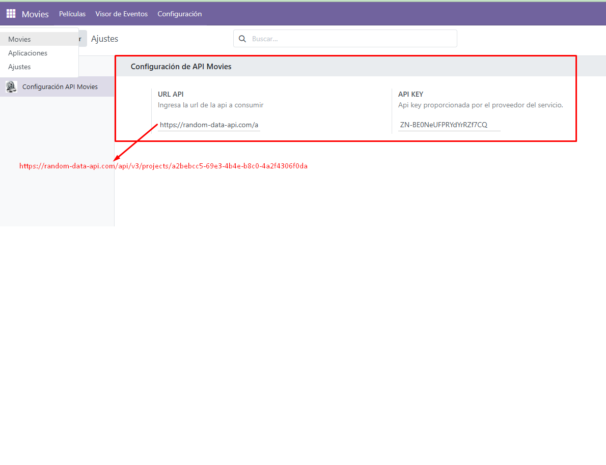

# odoo18-movies
En este repositorio se encuentra la configuración de un archivo docker para levantar Odoo v18, un módulo que consume un API Rest de Peliculas y proporciona una api Rest que retorna 10 peliculas basadas en su ranking de manera descendente.

# Configuración de Docker
El archivo docker compose se encuentra configurado de la siguiente forma:

### odoo:18.0-20250401
User: odoo  
Pass: admin  
Port: 8045  

### postgres:15
User: postgres  
Pass: admin  
Port: 5445  

# Levantar el proyecto en Docker
Para levantar el proyecto a través del archivo docker-compose.yml es necesario tener instalado el programa docker.

Este se puede descargar desde la siguiente url [Sitio Oficial Docker](https://www.docker.com/).
Una vez instalado en la maquina, se debe clonar el repositorio, posicionar la consola de comandos en la carpeta donde se encuentra el archivo docker-compose.yml y ejecutar la siguiente linea de comando  
 > docker-compose up -d

Luego de ejecutar ese comando se comenzara a descargar las imagenes y configurarlas.

### Crear base de datos
Cuando ya este configurado Odoo ir al navegador e ingresar a la siguiente ruta http://localhost:8045  
      
Dar clic en el botón  ***Create Database*** utilizando la master password que aparecera en la parte del recuadro amarillo.

### Instalación de Módulo
Una vez dentro de la base de datos creada ir al módulo de aplicaciones y activar el módulo movies
      

### Configurar módulo movies
Al tener instalado el módulo ahora se debe configurar la api externa de consulta [API de Peliculas](https://random-data-api.com/api/v3/projects/a2bebcc5-69e3-4b4e-b8c0-4a2f4306f0da?api_key=ZN-BE0NeUFPRYdYrRZf7CQ)  

Para configurar este módulo es necesario entrar al módulo movies a través del Menú de Odoo, una vez dentro se mostrara una grilla y un menu donde se debe presionar la opción configuración.
    

Cuando se instalo el módulo movies, se creo el cron configurado a través de xml para realizar la petición a la API configurada.
    
    

Cada que se ejecuta este cron va dejando un registro en una tabla llamada visor.eventos, este es un log que guarda cada consulta realizada por el sistema a la API de Peliculas.
    

A través de Postman se puede probar el Endpoint que retorna las 10 peliculas con mejor ranking.
    La url de prueba es http://localhost:8045/api/top_movies  yo le envie unas llaves vacias ya que el método es de tipo json y esta esperando una solicitud json.
    
